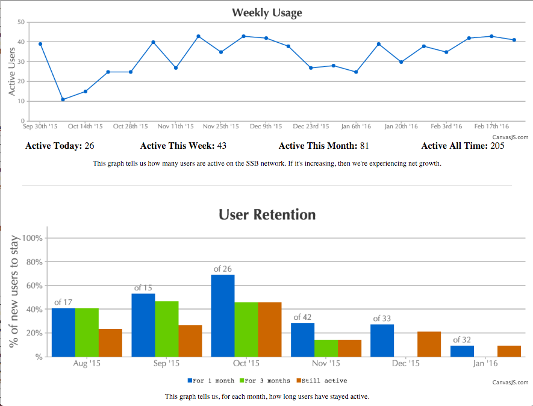

# Usage Stats

Scripts to generate network usage.

```
node index.js {active-timespans|active-weekly|lifespans}
  active-timespans: number of active users, for a set of past time intervals
  active-weekly: number of active users, per week
  lifespans: how long users are staying active (retention)
```

The helper script, `dump.sh`, will run each script and write to a `.json`.
You can then host the folder and open `index.html` to see a visualization of the data.

